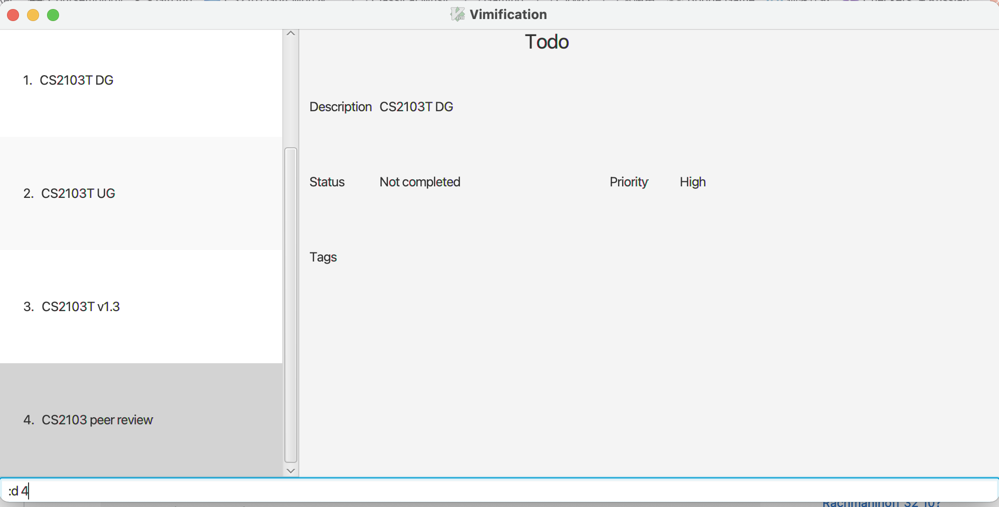

Vimification Level 3 (AB3) is a **desktop app for managing contacts, optimized for use via a Command Line Interface** (CLI) while still having the benefits of a Graphical User Interface (GUI). If you can type fast, AB3 can get your contact management tasks done faster than traditional GUI apps.

- Table of Contents
  {:toc}

---

## Quick start

1. Ensure you have Java `11` or above installed in your Computer.

1. Download the latest `addressbook.jar` from [here](https://github.com/se-edu/addressbook-level3/releases).

1. Copy the file to the folder you want to use as the _home folder_ for your Vimification.

1. Open a command terminal, `cd` into the folder you put the jar file in, and use the `java -jar addressbook.jar` command to run the application. 
   A GUI similar to the below should appear in a few seconds. Note how the app contains some sample data. 
   

1. Type the command in the command box and press Enter to execute it. e.g. typing **`help`** and pressing Enter will open the help window. 
   Some example commands you can try:

   - `list` : Lists all contacts.

   - `add n/John Doe p/98765432 e/johnd@example.com a/John street, block 123, #01-01` : Adds a contact named `John Doe` to the Address Book.

   - `delete 3` : Deletes the 3rd contact shown in the current list.

   - `clear` : Deletes all contacts.

   - `exit` : Exits the app.

1. Refer to the [Features](#features) below for details of each command.

---

## Features

**:information_source: Notes about the command format:** 

- Words in `UPPER_CASE` are the parameters to be supplied by the user. 
  e.g. in `add n/NAME`, `NAME` is a parameter which can be used as `add n/John Doe`.

- Items in square brackets are optional. 
  e.g `n/NAME [t/TAG]` can be used as `n/John Doe t/friend` or as `n/John Doe`.

- Items with `…`​ after them can be used multiple times including zero times. 
  e.g. `[t/TAG]…​` can be used as ` ` (i.e. 0 times), `t/friend`, `t/friend t/family` etc.

- Parameters can be in any order. 
  e.g. if the command specifies `n/NAME p/PHONE_NUMBER`, `p/PHONE_NUMBER n/NAME` is also acceptable.

- If a parameter is expected only once in the command but you specified it multiple times, only the last occurrence of the parameter will be taken. 
  e.g. if you specify `p/12341234 p/56785678`, only `p/56785678` will be taken.

- Extraneous parameters for commands that do not take in parameters (such as `help`, `list`, `exit` and `clear`) will be ignored. 
  e.g. if the command specifies `help 123`, it will be interpreted as `help`.

### Viewing help : `help`

Shows a message explaning how to access the help page.

Format: `help`

### Adding a to-do task

Adds a to-do to Vimification.

Format: `:i todo <description>`
| parameter | description | examples |
| ------------- | ----------------------------------------------- | ------------ |
| `description` | description of the task. | `CS2103T UG` |

Examples:

`:i todo CS2130T UG`
**Before**

**After**

`:i todo CS2103T DG`
**Before**

**After**

### Adding a task with deadline

Adds a task with `deadline` to Vimification.

Format: `:i deadline [description] /[deadline]`

| parameter     | description                                     | examples     |
| ------------- | ----------------------------------------------- | ------------ |
| `description` | description of the task.                        | `CS2103T UG` |
| `deadline`    | The deadline of the task in `YYYY-MM-DD` format | `2023-03-31` |

Examples:

`:i deadline CS2130T v1.3 /2022-03-31`
**Before**

**After**

### Deleting a task `:d`

Deletes the specified person from the address book.

Format: `:d [task_index]`

- Deletes the task at the specified `task_index`.
- The index refers to the index number shown in the displayed `TaskList`.
- The index **must be a positive integer**, i.e 1, 2, 3, …​
- The index must not exceed the number of tasks in `TaskList`, otherwise Vimification will show an error message.

Examples:

**Before**

**After**

### Exiting the program

Similar to Vim, we can use the `q` command with write `w` to exit the program.

Format: `:wq!`, `:q!`,,`:wq`,`:q`

Examples:

### Saving the data

Vimification data are saved in the hard disk automatically after any command that changes the data. There is no need to save manually.

### Editing the data file

Vimification data are saved as a JSON file `[JAR file location]/data/tasklist.json`. Advanced users are welcome to update data directly by editing that data file.

:exclamation: **Caution:**
If your changes to the data file makes its format invalid, Vimification will discard all data and start with an empty data file at the next run.

### Archiving data files `[coming in v2.0]`

_Details coming soon ..._

---

## FAQ

**Q**: How do I transfer my data to another Computer? 
**A**: Install the app in the other computer and overwrite the empty data file it creates with the file that contains the data of your previous Vimification home folder.

---

## Command summary

| Action           | Format, Examples                                                                         |
| ---------------- | ---------------------------------------------------------------------------------------- | --- |
| **Add To-do**    | `:i todo [description]`   e.g., `i todo CS2103T UG`                                   |
| **Add Deadline** | `:i deadline [description] /[deadline]`   e.g., `i deadline CS2103T v1.3 /2022-03-31` |     |
| **Delete**       | `:d [index]`  e.g., `:d 3`                                                            |
| **Exit**         | `:wq!`, `:q!`,,`:wq`,`:q`                                                                |
| **Help**         | `help`                                                                                   |
